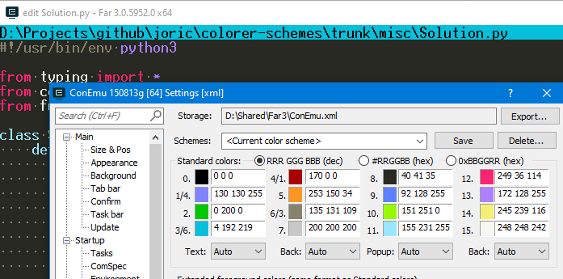
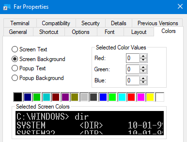

# Colorer Schemes

Monokai-like Far Manager color schemes


## Installation

### HRC

```
copy *.hrc %FARHOME%\Plugins\FarColorer\base\auto\
```

### HRD

```
copy *.hrd %FARHOME%\Plugins\FarColorer\base
copy *.xml %FARHOME%\Plugins\FarColorer\base

```

* Open editor file, press F11, select Far Colorer, Configure, Main settings
* Set "Users file of color styles" to `%FARHOME%\Plugins\FarColorer\base\catalog-user.xml`
* Select "Monokai" in schemes.

Reload colorer with F11, Far Colorer, Reload in editor after editing/copying the files (or restart Far).

### Color settings

With conemu you can use monokai colors both in a console and in an RGB mode. Default 16-color is recommended.

1. First, use `Far.exe /import far-colors.farconfig` to import color settings for the Far interface ("DN-like" colors).
2. Copy/paste color section (RGB values) from `misc/conemu-colors.xml` to `conemu.xml` (you should try [Conemu](https://conemu.github.io/)).



* Alternatively, adjust RGB values in the Far Manager application shortcut (but I'd rather use Conemu).



* Alternatively, use Monokai-RGB TrueMod (conemu only). Use `misc/conemu_to_rgb.py` to export conemu colors.

## Whitespace

Note that whitespace color is buggy in the stock colorer in the RGB mode,
it uses inverted (RGB->BGR) `def:Text` colors. You may download patched colorer
with `def:Whitespace` support in the [releases](https://github.com/joric/colorer-schemes/releases) section.
My schemes already support this feature.
You don't really need it though, default whitespace color in 16-color mode looks fine.

## Supported syntax

* Python, C/C++, HTML, Proto, GLSL/HLSL (also in HTML tags), JSON, JavaScript, Markdown (fenced code blocks).

Default text is light grey to support stock colorer whitespace color and be readable.
It kind of supports all Colorer languages but you'd have to add a lot of extra rules to match the original Monokai.
Pull requests are welcome. 


